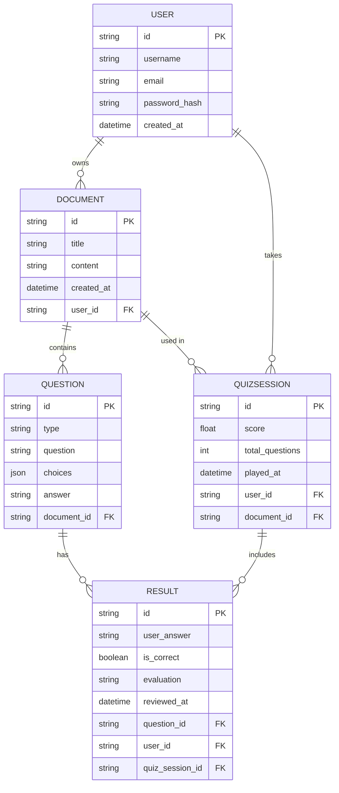

```
📦mcq-generator
 ┣ 📂app
 ┃ ┣ 📂routes
 ┃ ┣ 📄api.py
 ┃ ┗ 📄__init__.py
 ┣ 📂core
 ┃ ┣ 📄extraction.py
 ┃ ┣ 📄llm.py
 ┃ ┗ 📄__init__.py
 ┣ 📂files
 ┃ ┣ 📄cv.pdf
 ┃ ┣ 📄LetterOfRecommandation_lingJin.pdf
 ┃ ┗ 📄ssondo_preprint.docx
 ┣ 📂notebooks
 ┃ ┗ 📄testing.ipynb
 ┣ 📂tests
 ┃ ┣ 📄conftest.py
 ┃ ┣ 📄test_extraction.py
 ┃ ┗ 📄test_llm.py
 ┣ 📄.gitignore
 ┣ 📄.python-version
 ┣ 📄main.py
 ┣ 📄pyproject.toml
 ┣ 📄README.md
 ┗ 📄uv.lock
```



