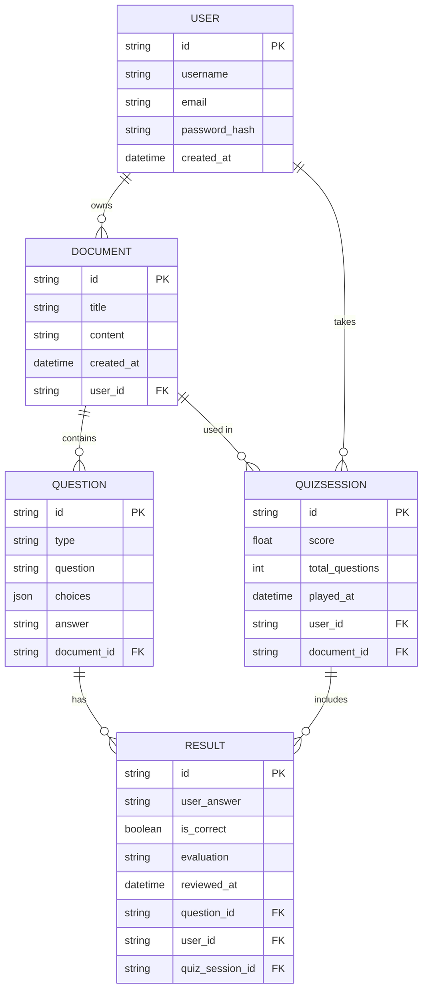

```mermaid
erDiagram
    USER ||--o{ DOCUMENT : owns
    USER ||--o{ QUIZSESSION : takes
    DOCUMENT ||--o{ QUESTION : contains
    DOCUMENT ||--o{ QUIZSESSION : "used in"
    QUESTION ||--o{ RESULT : has
    QUIZSESSION ||--o{ RESULT : includes

    USER {
        string id PK
        string username
        string email
        string password_hash
        datetime created_at
    }

    DOCUMENT {
        string id PK
        string title
        string content
        datetime created_at
        string user_id FK
    }

    QUESTION {
        string id PK
        string type
        string question
        json choices
        string answer
        string document_id FK
    }

    RESULT {
        string id PK
        string user_answer
        boolean is_correct
        string evaluation
        datetime reviewed_at
        string question_id FK
        string user_id FK
        string quiz_session_id FK
    }

    QUIZSESSION {
        string id PK
        float score
        int total_questions
        datetime played_at
        string user_id FK
        string document_id FK
    }
```
